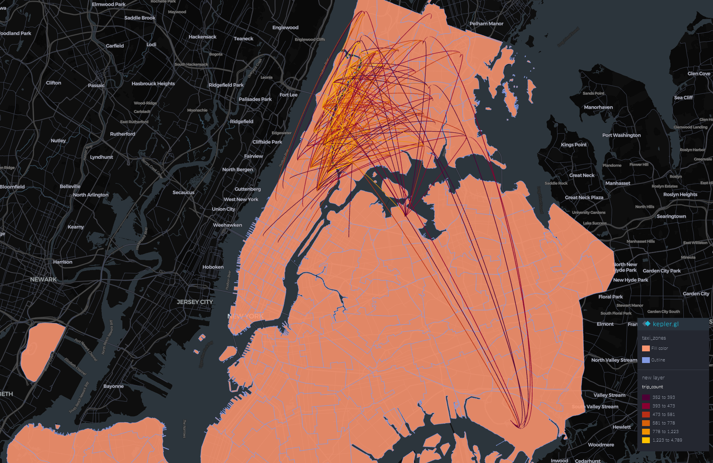
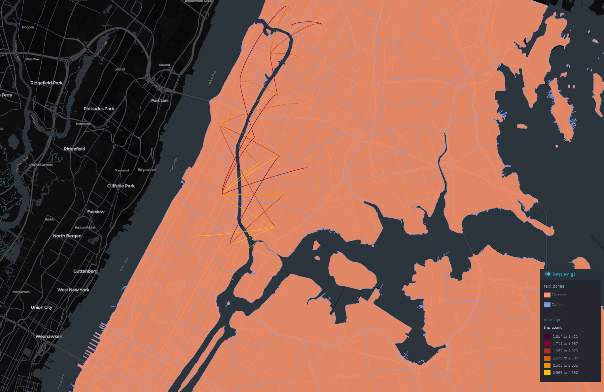

# Identifying and Addressing Transit Deserts in the Bronx
**DAT 490 Capstone Project Arizona State University**  
David Bonsaver, Geoffrey Barry, Andrew Nagle | May 2025

---

## Overview

New York City's public transit system is among the most extensive in the world but its coverage is not equitable. This project uses large-scale taxi trip data, geospatial analysis, and socioeconomic clustering to identify where transit demand is unmet, with a focus on the Bronx as a case study in structural underservice.

The core question: **Can data science tell us where to build transit, and whether building it is economically justifiable?**

Our answer: yes to the first, and sobering on the second.

---

## Key Findings

- **The Bronx is measurably underserved.** Welch's t-tests and ANOVA confirmed that Bronx-originating taxi trips are fewer, longer, and more expensive relative to Manhattan and Queens consistant with riders substituting taxi for transit that doesn't exist.
- **Geographic barriers, not just distance, drive taxi demand.** Spatial flow analysis revealed that the Harlem River crossing is the dominant structural bottleneck shaping Bronx trip patterns trips cluster around a small number of bridge crossings rather than distributing across the borough.
- **The Bronx concentrates disadvantage.** K-Means clustering across eight socioeconomic indicators (rent burden, educational attainment, disability rates, internet access, and others) identified the Bronx as the borough most concentrated with high-need census tracts. A logistic regression model predicting DAC designation achieved McFadden's R² = 0.541, with renter percentage, COPD rates, and education level as primary predictors.
- **Subway expansion is not economically viable on fare savings alone.** Cost-benefit modeling of three construction scenarios (full loop, mini loop, lateral-only) showed subway payback periods of 100–340 years. Light rail payback periods ranged from 9–68 years depending on assumptions far more viable, though the optimistic end requires scrutiny.
- **The realistic path forward is multimodal.** Bus rapid transit, demand-responsive microtransit, and services like Dollaride's CTAP program represent more tractable near-term interventions than capital-intensive rail.

---

## Visualizations

### Trip Flow Out of the Bronx (>350 trips, dropoff outside Bronx)

*Long-distance trips from the Bronx converge on NYC airports (LaGuardia, JFK) evidence of taxi dependency for airport access due to absent direct transit links.*

### Trip Flow Into the Bronx (>1,632 trips)

*High-volume inbound trips cluster along the western edge of the Bronx, crossing the Harlem River via a small number of bridges. Trips are not distributed they are bottlenecked.*


---

## Methodology

This project followed a multi-stage pipeline:

**1. Data Collection and Preprocessing**  
NYC TLC trip data (Yellow, Green, FHV, HVFHV) for January 2025 was combined into a unified parquet file containing over 2 million records. Trip records were standardized across vendors, location codes were mapped to boroughs via GeoJSON taxi zone data, and fare components were aggregated into a single `fare` column. The NY State Disadvantaged Communities (DAC) Census Tract Dataset was cleaned, merged with TIGER/Line shapefiles, and filtered to NYC's five boroughs.

**2. Exploratory Data Analysis**  
Initial EDA in R (2018 taxi data) examined trip distance distributions, borough-level trip volumes, and temporal patterns (heatmap of pickups by hour and day of week). Python-based EDA extended this to the full 2025 dataset and introduced spatial choropleths overlaying socioeconomic indicators with DAC designation boundaries.

**3. Geospatial Flow Analysis (Kepler.gl)**  
Trip-level origin-destination data was aggregated by zone pair and vendor, projected to lat/lng coordinates, and visualized in Kepler.gl using Arc Layers scaled by trip volume. Filtering by trip count threshold revealed the Harlem River bottleneck and airport dependency patterns.

**4. Clustering**  
- *Socioeconomic clustering:* K-Means (k selected via elbow method and silhouette analysis) grouped census tracts by eight standardized indicators.  
- *Spatial trip clustering:* A KD-Tree based approach (0.5-mile radius, weighted by trip count) condensed origin-destination points into demand hotspots. DBSCAN with multiprocessing was used for large-scale cluster merging.

**5. Statistical Inference**  
Welch's two-sample t-tests compared trip distance and cost between boroughs. One-way ANOVA with Tukey's HSD post hoc tests assessed differences across all five boroughs. Additional t-tests compared DAC vs. Non-DAC tracts across socioeconomic indicators.

**6. Predictive Modeling**  
Logistic regression modeled the probability of DAC designation using ten socioeconomic predictors. Performance was evaluated via McFadden's pseudo-R², with 95% confidence intervals reported for odds ratios.

**7. Cost-Benefit Analysis**  
Transit substitution modeling estimated annual savings from replacing qualifying short Bronx taxi trips (≤3 miles, 6AM–10PM, 1–2 passengers) with subway or light rail at 15% and 30% capture rates. Construction costs were benchmarked against the Second Avenue Subway ($1.5–2.5B/mile) and Interborough Express estimates for light rail ($400M/mile). Payback periods were calculated for three route configurations.

---

## Repository Structure

```
├── README.md
├── reports/
│   ├── Final_draft.pdf              ← Full capstone paper (35 pages)
│   ├── dat_490_EDA.pdf              ← EDA report with Kepler maps and DAC analysis
│   ├── DAT_490_Lit_review.pdf       ← Literature review
│   └── Dat_490_Project_plan.pdf     ← Original project plan
├── notebooks/
│   └── Capstone_DAC_EDA.ipynb      ← DAC socioeconomic analysis (Python)
├── src/
│   ├── 01_Read_shp.py               ← Load and visualize NYC taxi zone shapefile
│   ├── 02_Convert_to_GEOjson.py     ← Reproject and export to GeoJSON
│   ├── 03_Combine_to_1_parquet.py   ← Combine TLC trip sources into unified parquet
│   ├── 04_Combine_to_1_parquet_part_2.py  ← Extended version with vendor labels and fares
│   ├── 05_1st_flow_diagram.py       ← Flow visualization (Bronx outbound, matplotlib)
│   ├── 06_Upload_to_kepler.py       ← Prepare CSV for Kepler.gl arc layers
│   ├── 07_KNN_clustering.py         ← KNN + agglomerative clustering of OD trip pairs
│   ├── 08_merge_clusters_dbscan_multiprocessing.py  ← DBSCAN cluster merging (parallel)
│   └── 09_Cluster_the_clusters.py   ← Final KD-Tree cluster condensation
├── r_analysis/
│   ├── Capstone_R.Rmd               ← Initial EDA (2018 Yellow Taxi data)
│   ├── Capstone_R_2.Rmd             ← Extended R analysis
│   └── Capstone-R.html              ← Rendered output
├── maps/
│   ├── kepler_bronx_only_map.html
│   ├── Kepler_map_KDTreeclusters.html
│   ├── kepler_complete_parquet.html
│   └── [PNG screenshots]
└── data/
    └── README.md                    ← Data sources and download instructions
```

---

## Data Sources

Raw trip data files are not included in this repository due to size. They can be downloaded directly from their sources:

| Dataset | Source |
|---|---|
| NYC TLC Trip Record Data (2025) | [nyc.gov/tlc](https://www.nyc.gov/site/tlc/about/tlc-trip-record-data.page) |
| NYC Taxi Zone Shapefile / GeoJSON | [nyc.gov/tlc](https://www.nyc.gov/site/tlc/about/tlc-trip-record-data.page) |
| NY State DAC Census Tract Dataset | [climate.ny.gov](https://climate.ny.gov/resources/disadvantaged-communities-criteria/) |
| TIGER/Line Shapefiles (2020) | [census.gov](https://www.census.gov/geographies/mapping-files/2020/geo/tiger-line-file.html) |
| 2018 Yellow Taxi Trip Data (R analysis) | [data.gov](https://catalog.data.gov/dataset/2018-yellow-taxi-trip-data) |

---

## Tools and Libraries

**Python:** pandas, geopandas, numpy, scikit-learn, scipy, matplotlib, shapely, pyarrow, tqdm  
**R:** tidyverse, ggplot2  
**Visualization:** Kepler.gl, Plotly  
**Other:** Jupyter Notebook

---

## Full Report

The complete capstone paper including statistical results, cost-benefit tables, and policy discussion is available in [`reports/Final_draft.pdf`](reports/Final_draft.pdf).
